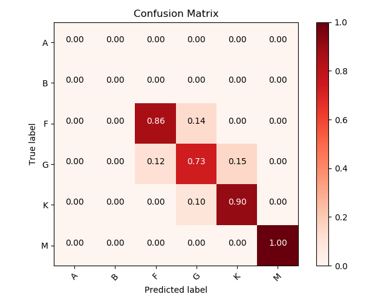

# mlcm

Multi Label Confusion Matrix for one-hot-encoded y_test and y_pred



## Getting Started

These instructions will get you a copy of the project up and running on your local machine for development and testing purposes.

### Prerequisites

This package relies on the usage of following packages:

```
numpy, matplotlib and itertools
```
These forementioned packages should already come with Anaconda. If you don't use Anaconda distribution you can install them via ```pip install [package]```.

### Installing

Download, unzip,  open a terminal and ```cd``` in the unzipped directory, and type: 

```
python setup.py install
```

At this point, open a python session and type:

```
import mlcm
```

If no errors pop up, you are ready to use the package.

## Usage

The package comes with three functions:

```
confusion_matrix, plot_confusion_matrix, draw_cm
```

The first one computes and return the confusion matrix for passed ```y_test``` and ```y_pred```, moreover, it prints the accuracy on the test-set:

```
cm = mlcm.confusion_matrix(y_test, y_pred)
```
The second one plot the confusion matrix passed as arguments; labels have to be passed also. You also have the possibility to normalize or not the matrix over the test-set observations (default = False).

```
mlcm.plot_confusion_matrix(cm, classes, normalize=False)
```

Finally, last function performs not only the calculation of the confusion matrix, but also returns and plots it:

```
cm = mlcm.draw_cm(y_test, y_pred, classes, normalize=False)
```

## Version

1.0.0

## Authors

* **Mario Damiano** - Github: [MDamiano](https://github.com/MDamiano) - Twitter: [@astromariodam](https://twitter.com/astromariodam) - e-mail: mdamiano91@gmail.com

## License

This project is distributed under the MIT License - see the [LICENSE](https://github.com/MDamiano/mlcm/blob/master/LICENSE) file for details

